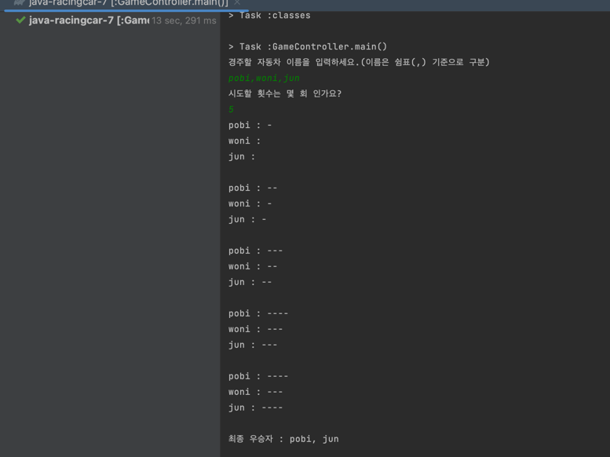

# java-racingcar-precourse

---

오후 8:36 기능요구사항 작성 시작

~

오후 9:03 기능요구사항 작성 완료

~
오후 10:49 실행했을 때 원하는 결과가 나오게 일단 동작함


~
오후 11:15 분명 잘 돌아가는데, 테스트케이스는 계속 실패했던거 고치려다 삽질만함. 리팩토링 시작 
이유 찾게됨. Application 클래스에서 main안에 작성해야했음(나는 다른 클래스의psvm 했엇다.)

## 입력 
- [ ] 경주할 자동차 이름(이름은 쉼표(,) 기준으로 구분)을 입력 받기
    - [ ] 갯수 제한 : 1~10개 까지 가능 하다.
    - [ ] 글자 제한 : 1~5자 까지 가능 하다.
- [ ] 시도할 횟수 입력 받기  
    - [ ] 범위 제한 : 1~10회 까지 가능 하다.
    - [ ] 양의 정수만 가능 하다.

## 출력
- [ ] 차수별 실행 결과를 자동차 이름과 함께 출력한다.
```java
pobi : --
woni : ----
jun : ---
```
- [ ] 단독 우승자 안내 문구를 출력한다.
```java
최종 우승자 : pobi
```

- [ ] 공동 우승자 안내 문구를 출력한다
```java
최종 우승자 : pobi, jun
```


## 기능 요구 사항 

### 자동차
- [x] 이름을 가지고 있다
    - [x] 글자 제한 : 1~5자 까지 가능 하다.
- [x] 전진 할 수 있다.
    - [x] 전진하는 조건은 0~9사이의 무작위 값을 구한 후 무작위 값이 4 이상일 경우이다.
- [x] 총 이동 횟수를 알고 있다.
- [x] 이름만으로 자동차를 생성한다.

- [x] 이름을 가져올 수 있다.
- [x] 총 이동 횟수를 가지올 수 있다.

- [x] 자동차의 레이싱 정보를 제공 한다.
### 라운드 결과
- [x] 자동차들의 레이싱정보(이름,움직인 횟수)를 관리
- [x] 최종 우승자를 뽑는다.

### 게임 

- [x] 반복 입력 횟수 만큼 게임을 진행한다.
- [x] 회차당 자동차들의 움직인 결과를 출력하게 한다.
- [x] 최종 승자 발표 한다.

